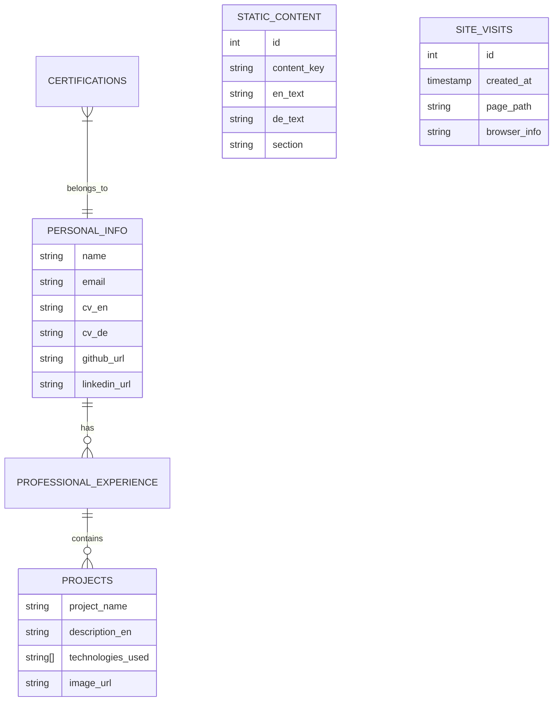

# 🚀 Amjad Awad-Allah | Professional Full-Stack Portfolio & CMS


> A high-performance, premium portfolio built for Software Developers and AI Specialists. Featuring a fully integrated Administrative CMS to manage content dynamically without touching the code.

---

## 🌐 Live Presence
- **Portfolio**: [amjadawadallah.com](https://amjadawadallah.com)
- **Admin Dashboard**: [amjadawadallah.com/admin](https://amjadawadallah.com/admin)

---

## ✨ Key Features

### 🎨 Premium UI/UX
- **Interactive Hero**: Dynamic "Skill Bubbles" that can be individually toggled from the admin panel.
- **3D Tilt Effects**: Interactive 3D cards for projects and certifications using `framer-motion`.
- **Dynamic Preloader**: Professional entry animation with technical theme.
- **Glassmorphism Design**: Modern, sleek aesthetics with dark/light mode support.

### 🛠️ Integrated Admin CMS (Backend)
- **Granular Control**: Manage individual visibility of hero elements and section content.
- **Projects Management**: Add, edit, or delete projects with multi-language support.
- **Experience Timeline**: Manage professional history and roles.
- **Certification Center**: Track and feature professional credentials and Credly badges.
- **Personal Info**: Update social links, CVs, and contact details in real-time.

### 🌍 Internationalization
- Full support for **English** and **German** languages.
- Intelligent language toggle with smooth transition animations.

---

## 📊 Database Schema (Supabase / PostgreSQL)

The application uses a relational database structure designed for high performance and scalability. Below is the entity relationship model:



### Table Details:
- **`personal_info`**: Stores the primary identity, contact details, and social links.
- **`professional_experience`**: Manages the career timeline and role descriptions.
- **`projects`**: Contains project details, tech stacks (JSONB), and media links.
- **`certifications`**: Stores professional credentials, Credly badge URLs, and verification links.
- **`static_content`**: A flexible key-value store for UI text, enabling dynamic updates for hero labels and visibility settings.
- **`site_visits`**: Internal analytics table to track page views and visitor demographics.

---

## 💻 Tech Stack

- **Frontend**: React 18, TypeScript, Tailwind CSS.
- **Animations**: Framer Motion, Lucide Icons.
- **Backend/DB**: Supabase (PostgreSQL) with Realtime updates.
- **Deployment**: Netlify with custom domain integration.
- **UI Components**: shadcn/ui.

---

## 🏗️ Getting Started

### Prerequisites
- Node.js (v18+)
- npm / yarn

### Installation
1. **Clone the repository**
   ```bash
   git clone https://github.com/amjad-awad-allah/portfolio.git
   ```

2. **Install dependencies**
   ```bash
   npm install
   ```

3. **Configure Environment Variables**
   Create a `.env` file in the root and add your Supabase credentials:
   ```env
   VITE_SUPABASE_URL=your_supabase_url
   VITE_SUPABASE_ANON_KEY=your_anon_key
   ```

4. **Run Development Server**
   ```bash
   npm run dev
   ```

---

## 📬 Contact & Connect
- **LinkedIn**: [amjad-awad-allah](https://www.linkedin.com/in/amjad-awad-allah)
- **Email**: [amjad.awadallah93@gmail.com](mailto:amjad.awadallah93@gmail.com)
- **GitHub**: [@amjad-awad-allah](https://github.com/amjad-awad-allah)

---
Developed with ❤️ by **Amjad Awad-Allah**.
